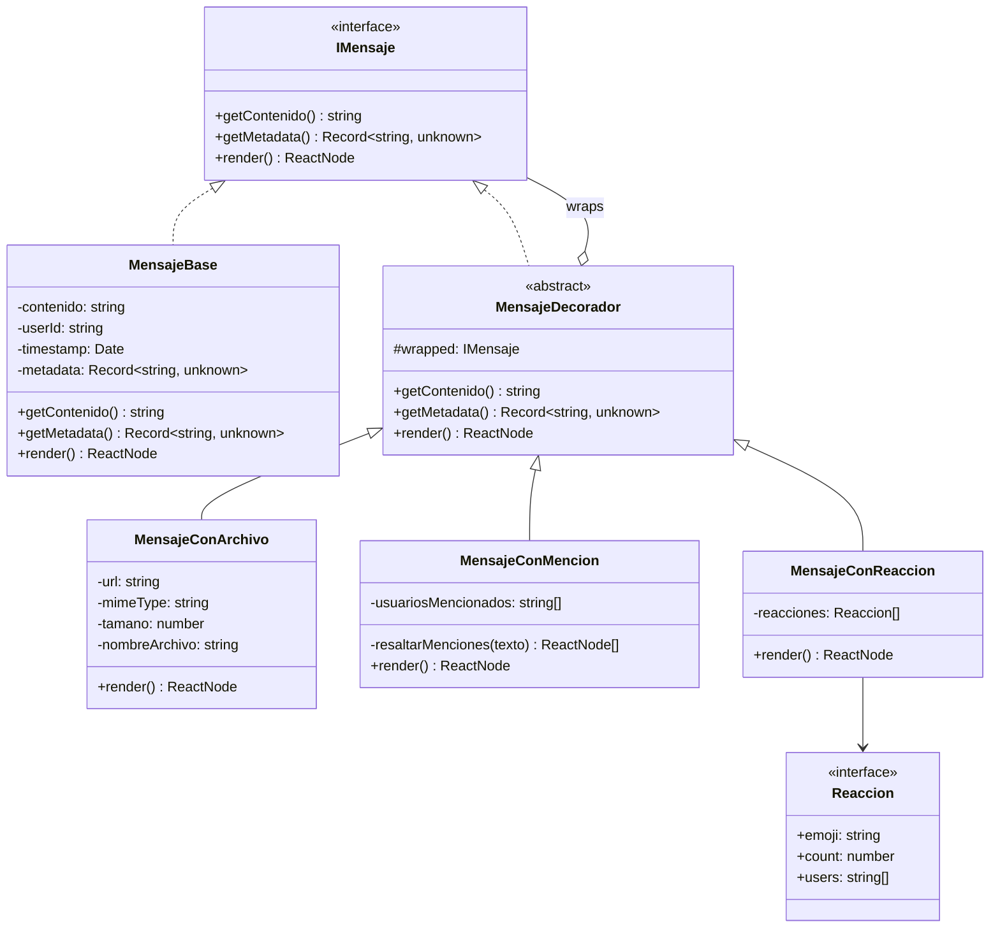

# Patrón Decorator — Mensajes de Chat

## Propósito

En el chat de UniConnect los mensajes pueden incorporar responsabilidades adicionales (archivos adjuntos, menciones de usuarios, reacciones) de forma independiente y combinable. El patrón Decorator permite agregar estas capacidades envolviendo `MensajeBase` sin modificarla, manteniendo cada responsabilidad aislada en su propio decorador y permitiendo cualquier combinación en tiempo de construcción.

---

## Diagrama UML



---

## Ejemplo de uso

Los constructores exactos son los siguientes:

```typescript
import {
  MensajeBase,
  MensajeConArchivo,
  MensajeConMencion,
  MensajeConReaccion,
  type Reaccion,
} from './index';

// Ejemplo 1: mensaje de texto plano
const base = new MensajeBase(
  'Hola equipo, revisen el informe @user-002 y @user-003',
  'user-001',
  new Date('2026-05-06T22:00:00Z'),
);

// Ejemplo 2: texto + archivo adjunto
const conArchivo = new MensajeConArchivo(
  base,
  'https://storage.example.com/informe.pdf',
  'application/pdf',
  204800,          // bytes
  'informe.pdf',
);

// Ejemplo 3: archivo + menciones
const conMencion = new MensajeConMencion(
  conArchivo,
  ['user-002', 'user-003'],
);

// Ejemplo 4: los tres decoradores encadenados
const reacciones: Reaccion[] = [
  { emoji: '👍', count: 3, users: ['user-002', 'user-003', 'user-004'] },
];
const completo = new MensajeConReaccion(conMencion, reacciones);

// getContenido() y getMetadata() propagan por toda la cadena sin modificación
const contenido: string = completo.getContenido();
// → 'Hola equipo, revisen el informe @user-002 y @user-003'

const metadata: Record<string, unknown> = completo.getMetadata();
// → { userId: 'user-001', timestamp: Date }
```

La cadena puede construirse en cualquier orden y con cualquier subconjunto de decoradores; cada uno delega hacia `this.wrapped` para las operaciones que no extiende.

---

## Integración con Observer (US-002)

Cuando un `ChatSubject` recibe un mensaje enviado por el usuario, invoca `getMetadata()` sobre el objeto decorado para extraer `userId` y `timestamp` antes de construir el evento que emite a los suscriptores via Socket.io. El resultado de `render()` se proporciona como carga del evento, de modo que cada suscriptor (historial, notificaciones, métricas) consume el árbol de React ya enriquecido con archivos, menciones y reacciones sin necesidad de conocer la cadena de decoradores subyacente.

---

## Archivos del módulo

| Archivo | Clase / Interfaz | Rol en el patrón |
|---|---|---|
| `IMensaje.ts` | `IMensaje` | Componente — interfaz común |
| `MensajeBase.tsx` | `MensajeBase` | ConcreteComponent — implementación base |
| `MensajeDecorador.ts` | `MensajeDecorador` | Decorator abstracto — delega a `wrapped` |
| `MensajeConArchivo.tsx` | `MensajeConArchivo` | ConcreteDecorator — añade bloque de archivo |
| `MensajeConMencion.tsx` | `MensajeConMencion` | ConcreteDecorator — resalta @menciones |
| `MensajeConReaccion.tsx` | `MensajeConReaccion` | ConcreteDecorator — añade chips de reacción |
| `index.ts` | — | Barrel de exportaciones públicas |
| `ejemplo-uso.ts` | — | Snippet de componibilidad (compila con `tsc --noEmit`) |
